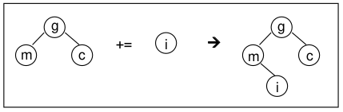

# Sobrecarga de Operadores

Escreva um programa que implemente uma classe `Cadastro` para gerenciamento de pacientes hospitalares. A classe `Cadastro` utiliza uma estrutura do tipo árvore binária, implementada como uma classe template, seguindo a estrutura`template <class T> class Arvore`.

 A classe `Cadastro` deve oferecer as seguintes operações:

- **Inserção:**  A inserção é realizada através do método `insere` que emprega o operador **+=**, como em `arvore += paciente`, implementado na classe
  template `Arvore`. Cada elemento inserido deve ser armazenado na árvore privada. Para isso, o elemento é posicionado à esquerda do nó raiz atual da árvore, caso o nome do paciente seja maior em ordem alfabética que o do nó raiz. Caso o nome seja menor em ordem alfabética, este deve ser posicionado à direita do nó raiz atual. Este procedimento pode ser realizado de forma recursiva. A figura abaixo ilustra a inserção do caractere **'i'** na árvore binária de caracteres. Note que a primeira comparação foi entre a raiz atual **'g'** e o **'i'**. A comparação demonstrou que o caractere **'i'** é maior em ordem alfabética que o **'g'** e, como tal, deve ser posicionado à esquerda de **'g'**. Em seguida, a mesma comparação é realizada com o **'m'**, raiz atual da sub-árvore à esquerda, onde se conclui que **'i'** é menor que **'m'**. Portanto, o caractere **'i'** deve ser posicionado à direita do **'m'**. Como não   há mais nenhuma sub-árvore à direita do **'m'**, o caractere **'i'** é finalmente inserido. Não há preocupações em manter a árvore balanceada.

  
  
  A inserção deve retornar um ponteiro para o nó inserido ou `NULL` caso a operação de inserção falhe. Uma falha ocorre caso um paciente com o mesmo nome já exista no cadastro.
  
  
  
- **Busca:** A busca deve ser realizada através do método `busca` que utiliza o operador **()**, como em `arvore(“nome”)`. A busca retorna um ponteiro para o elemento encontrado ou `NULL`, caso contrário. A busca é realizada a partir do nome do paciente, uma vez que não é permitido inserir dois pacientes com o mesmo nome.

  

- **Impressão:** A impressão de todos os elementos da árvore pode ser obtida através de método `imprime`. Todos os pacientes da árvore e seus atributos, por sua vez, devem ser impressos a partir do operador **<<**, como em `cout << arvore`. Para ajudar, é interessante implementar também o operador **<<** sobrecarregado para objetos da classe `Paciente`, como em `cout << paciente`.


> **Obs.<sub>1</sub>:** Note que, tanto a operação de inserção quanto a de busca podem retornar `NULL`. Trate esses casos como uma exceção na função principal. Caso essas exceções ocorram, o programa deve imprimir uma mensagem específica usando o método `what()` da classe `exception`.

> **Obs.<sub>2</sub>:** Não é necessário inserir tipos diferentes de pacientes no mesmo cadastro. Dessa forma, ao criar um cadastro, este poderá ser usado para armazenar pacientes de uma única classe, derivada ou não da classe `Paciente`. É importante, porém, reforçar que o cadastro deve funcionar independentemente da classe, derivada ou não da classe `Paciente`, escolhida.


O cadastro deve ser capaz de ser utilizado para armazenamento de pacientes diversos, com diferentes tipos de atributos privados específicos. Dessa forma, o cadastro tem que ser genérico o suficiente para ser utilizado para qualquer tipo de paciente. Crie, portanto, uma classe `Paciente` base e classes derivadas específicas. Utilize o conceito de polimorfismo.

Crie um menu que permita a execução de todas as ações por intermédio da interação com o usuário. Alternativamente, é permitido que as opções sejam passadas para o executável através de `argc` e `argv`.


**IMPORTANTE!** 

O cógido deve conter um `makefile` para compilar o programa e uma documentação indicando como utilizar o mesmo.


## Compilação

A compilção do programa pode ser feita utilizando o comando abaixo:

```bash
make all
```

A execução desse comando irá gerar o binário `main`.


## Execução

Após a compilação, a execução do programa pode ser feita de duas formas, interativa e por linha de comando. 

- **Interativa**

  Para executar o programa de forma interativa utilize o comando abaixo:

```bash
./main
```

  

Uma fez executado o programa deve te apresentar uma tela como essa:

```terminal
CADASTRO DOS PACIENTES

[1] - Cadastrar Paciente
[2] - Ver Pacientes Cadastrados
[3] - Buscar Paciente
[4] - Sair


Opcao: 
```

Basta interagir com os menus utilizando os números indicados.


- **Parametro de Linha**

  Para executar o programa por parametro de linha você deve indicar a sequencia de execução que deseja, passando os numeros dos menus usados no modo interativo e os valores de inserção ou busca. Veja o exemplo abaixo:

```bash
./main 1 Lucas 1 Sargeiro 1 Lucas 2 3 Lucas 3 Mello 4
```

  > **Obs**: a utilização do comando 4 para finalizar é opicional, caso o programa termine a sequencia e nao tenha encontrado um comando de sair ele irá sair automaticamente.

  Observe que apenas os comando **1** e **3** necessitam de um valor seguinte, usados respectivamente para inserção e busca.

